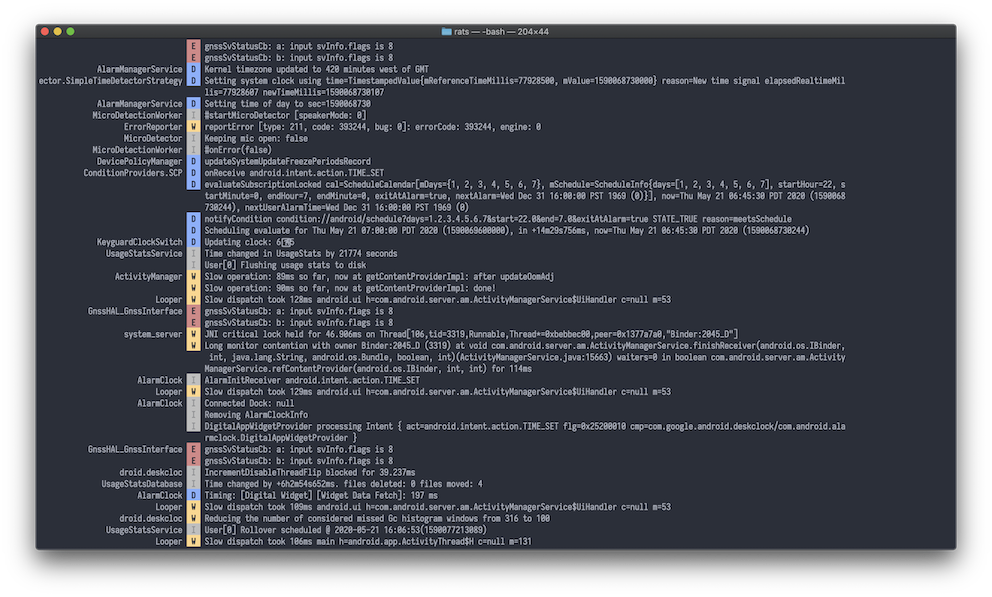

### rats :rat::rat:

[](https://github.com/pt2121/rats/actions) [](https://codecov.io/gh/pt2121/rats) [](LICENSE)

Another colored logcat inspired by [pidcat](https://github.com/JakeWharton/pidcat/) and [logcat-color](https://github.com/marshall/logcat-color) and written in Rust.

#### Usage

```
adb logcat | rats
```

or

```
adb logcat -v brief | rats
```

```
❯ rats -h
rats 0.1
pt2121@users.noreply.github.com

USAGE:
    rats [OPTIONS]

FLAGS:
    -h, --help       Prints help information
    -V, --version    Prints version information

OPTIONS:
    -l, --level <V,D,I,W,E,F,v,d,i,w,e,f>    Minimum level to be displayed
    -p, --package <applicationId>...         Application package name(s)
    -t, --tag <TAG>...                       Filter output by specified tag(s)
    -w, --tag-width <WIDTH>                  Width of log tag
```



#### [LICENSE](LICENSE)
